

  

# Learning for Small Data Sets: Classification of Sound Signals

## Problem
Engineers often diagnose broken vehicle components by their sound, e.g. the sound of the engine, the sound of the breaks or some rattling. Automatic detection and classification of mechanical noises caused by vehicle components helps engineers to repair cars andincreases safety by warning the driver if something is wrong. However, in real-world applications data sets are usually small and collecting data is expensive.

## Data
Real-world dataset from BMW that contains mechanical sounds of vehicle components and publicly available audio data sets.

  

#### Dataset from BMW

* Real-world Brake noise dataset
* Contains 1090 samples over 6 classes
* Unbalanced, small and noisy Dataset  
  => our main Idea: use pretrained models  
  additionally: Cross validation & Data Augmentation

#### Data Preprocessing

  

Original Audio Data (Waveform):
Sample Amplitude of sound wave at regular time intervals  
=> Transformation to Spectrogram:
from Time to Frequency Domain  
Output:
* Frequency Time Plot
* Image-like!

#### Data Augmentation Pipeline

 

 

## Project Goals

 

* Implement robust classifiers. 

  

* Reduce the number of training samples per class. 

  

* Analyze and optimize the performance.

## Used Architectures

  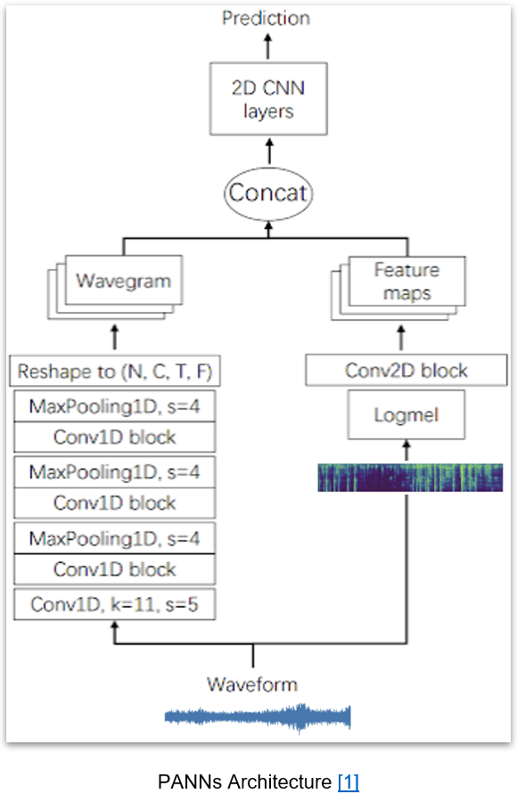

#### PANNs
* Input: both Spectrogram and Waveform
* Very deep architecture: Two **parallel** branches → Features Maps → Concatenation → Conv block → Classification
* Fully **pretrained** on the *AudioSet* dataset => achieves current state-of-the-art on AudioSet

#### SoundCLR
* Input: Spectrogram
* ResNet50 pretrained on ImageNet
* Model is trained with a **Hybrid loss**. 
* **Hybrid loss: Weighted sum** of supervised contrastive loss and a cross-entropy loss.

  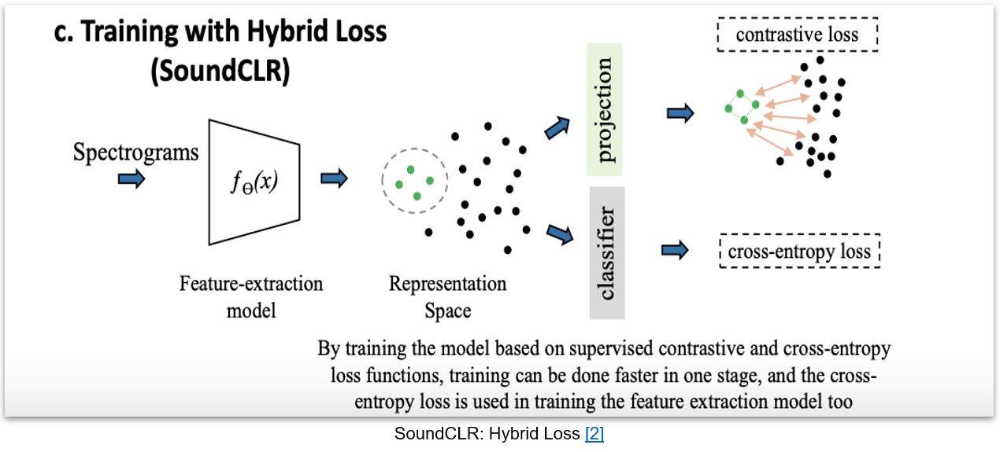

#### TALNetV3
* Input: Spectrogram
* Dual backbone consisting of:
  * Global feature extractor: **pretrained** on *AudioSet*
  * Specific feature extractor: **NOT** pretrained

  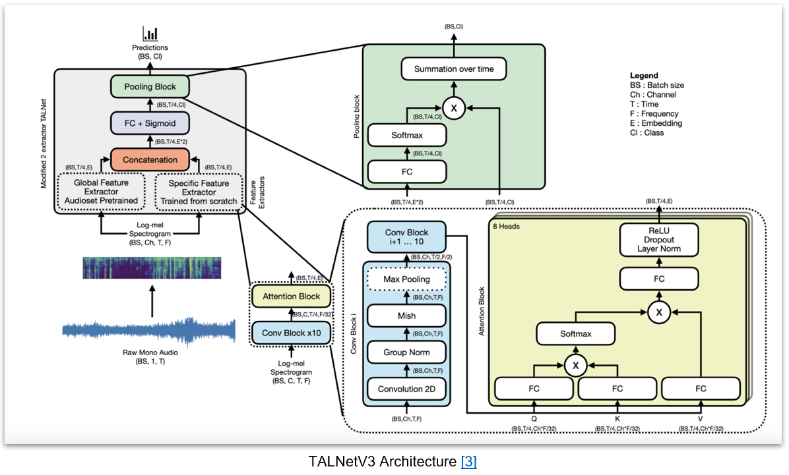

## Experiments
<table>
  <thead>
    <tr>
      <th>Training on the whole BMW data set</th>
      <th>Training with fewer samples</th>
    </tr>
  </thead>
  <tbody>  
    <tr>
      <td> - Train the models without data augmentation </td>
      <td> - Train with 40, 20, 10 and 5 samples from each class with 5 fold cross validation </td>
    </tr>
    <tr>
      <td> - Train with data augmentation </td>
      <td> - Train with 40, 20, 10 and 5 samples from each class with data augmentation with 5 fold cross validation </td>
    </tr>
  </tbody>
</table>

## Results

  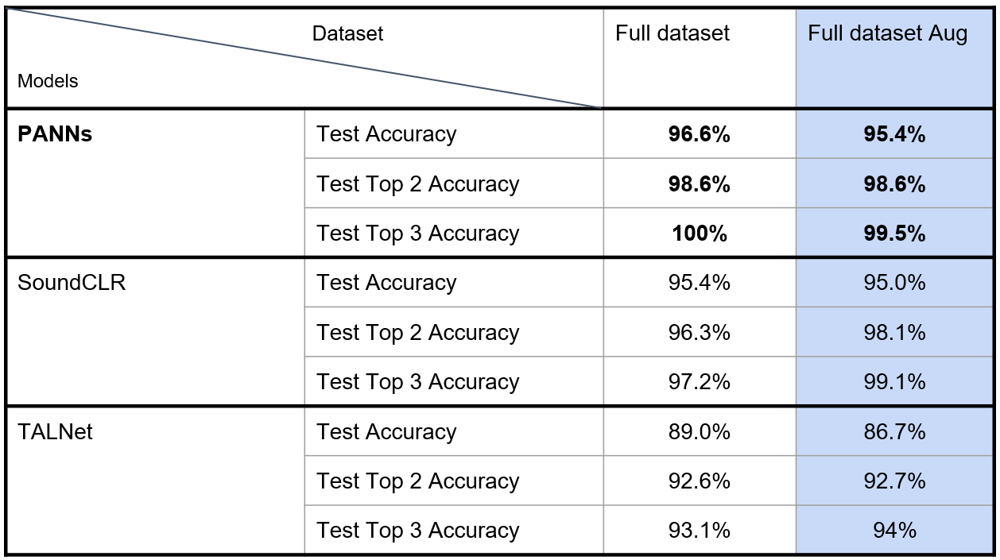

#### Results on the whole Dataset
First experiments:  
Training on the whole Dataset with & without Data Augmentation  
Metric used: Test Accuracy

Acquiring training samples takes a lot of effort!  
=> BMW interested in training with **fewer** samples per Class    
=> Next experiments: Investigate model performance on 40/20/10/5 samples **per Class**  
Metric: additionally Top 2/3 Accuracy

#### Results on fewer Samples per Class
<table><tr>
<td> 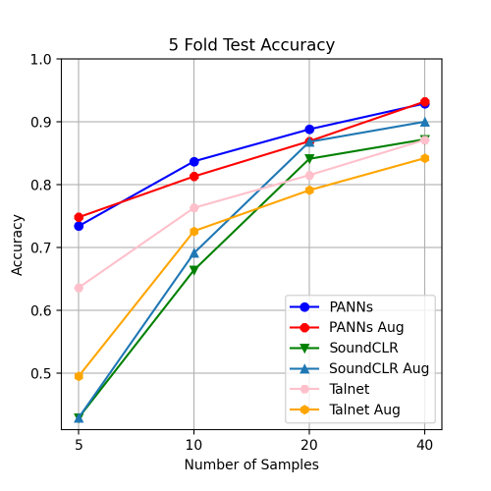 </td>
<td> 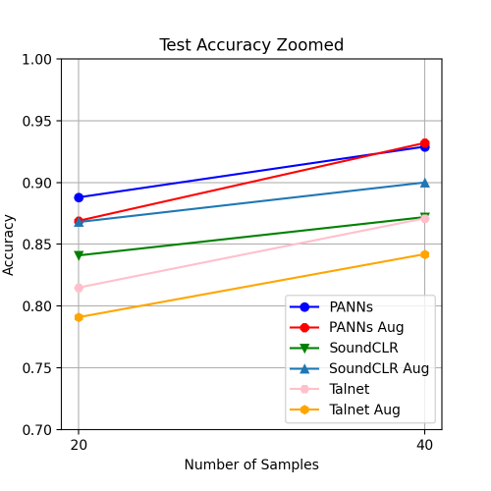 </td>
</tr></table>

* PANNs achieves best results, 93.9% on 40 samples
* SoundCLR benefits from Augmentation but has problems with fewer samples
* TALNetV3 performs worse with Augmentation

<table><tr>
<td> 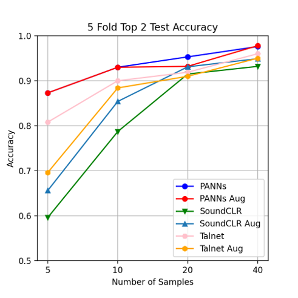 </td>
<td> 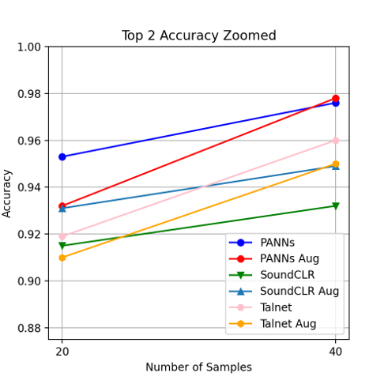 </td>
</tr></table>

* PANNs achieves over 93% Top 2 Accuracy for > 10 samples
* SoundCLR still has problems with fewer samples

<table><tr>
<td> 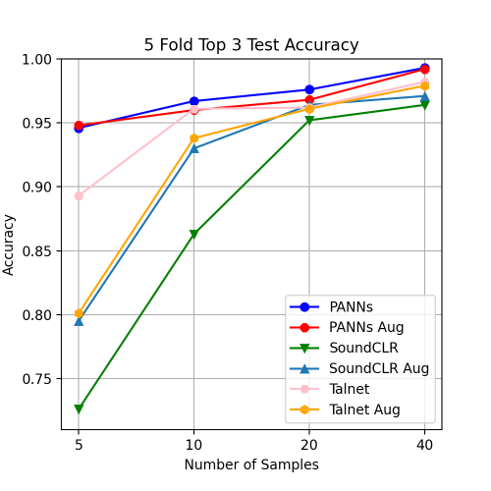 </td>
<td> 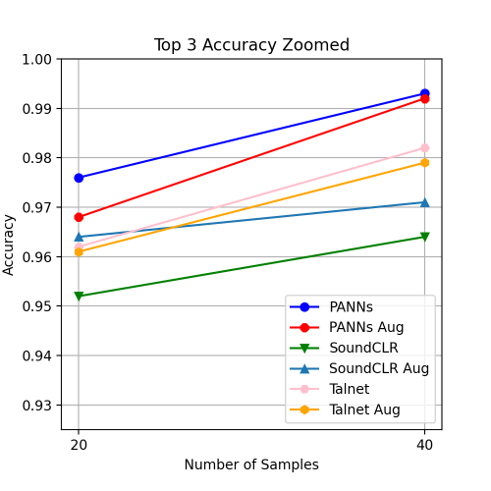 </td>
</tr></table>

PANNs achieves:
* Over 94.5% Top 3 Accuracy even for 5 samples
* \>99% Top 3 Accuracy for 40 samples

All the results presented in these graphs can be read from these tables:
<table>
  <tr>
    <td> Test Accuracy </td>
    <td>  </td>
  </tr>
  <tr>
    <td> Top 2 Accuracy </td>
    <td>  </td>
  </tr>
  <tr>
    <td> Top 3 Accuracy </td>
    <td>  </td>
  </tr>
</table>

#### Class-wise Accuracies PANNs

<table><tr>
<td> 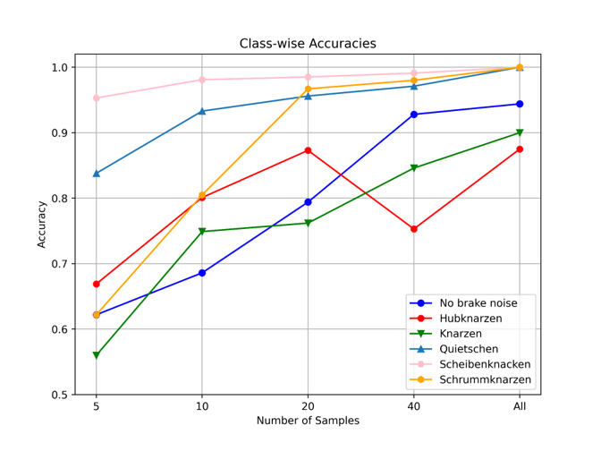 </td>
<td>  </td>
</tr></table>

* “Hubknarzen” hardest class to learn, always below 90% accuracy
* “Schrummknarzen” & “No brake noise” accuracy drops significantly for fewer samples
* “Scheibenknacken” is the easiest class to learn

The results presented in the graph can be read from this table:

  

#### Further Analysis PANNs 40 Samples
Accuracies only gave us an idea, whether the samples are predicted correctly or not. But we don’t have any idea about the wrongly predicted samples.

Two other metrics were computed:  
* class wise probabilities: averaged probabilities for each class
* confusion matrix: number of  predicted for each ground truth label

Why?
* to analyse further the effect of the number of samples on predicting each class and how confident the model is about its predictions 
* And to explore similarities between classes

<table><tr>
<td>  </td>
<td>  </td>
</tr></table>

* over 80% confidence for all classes except “Hubknarzen”
* a confusion between the three first classes. For example, almost 17% of samples of class “Hubknarzen” are predicted as “No Brake Noise”

<table><tr>
<td>  </td>
<td>  </td>
</tr></table>

* Here we can again see the drop in class “No brake noise” (confidance under 80%) 

<table><tr>
<td>  </td>
<td>  </td>
</tr></table>

* significant drop in confidence on “Schrummknarzen”
* overall drop

<table><tr>
<td>  </td>
<td>  </td>
</tr></table>

* “Scheibenknacken” (5th class) still almost always predicted correctly => easiest class
* “Quietschen” (4th class) also with good predictions. 
* However, the model has problems with the other classes.
* Worst performance with class Knarzen, with average probability is below 50%.

## Summary
Best Results with PANNs: 
* 96.6% test accuracy on full BMW dataset.
* 93.9% on 40 samples per class
* over 93% top 2 accuracy for up to 10 samples
 
=> It is possible to train a decent model using 10-20 samples per class.  
=> A fully pretrained architecture should be used for a dataset this small.

Performance with Augmentation depends on architecture:
* No significant boost for PANNs
* Accuracy increase for SoundCLR

## References
1. Kong, Q., Cao, Y., Iqbal, T., Wang, Y., Wang, W., & Plumbley, M. D. (2020). Panns: Large-scale pretrained audio neural networks for audio pattern recognition. IEEE/ACM Transactions on Audio, Speech, and Language Processing, 28, 2880-2894.
2. Nasiri, A., & Hu, J. (2021). SoundCLR: Contrastive Learning of Representations For Improved Environmental Sound Classification. arXiv preprint arXiv:2103.01929.
3. Arnault, A., Hanssens, B., & Riche, N. (2020). Urban Sound Classification: striving towards a fair comparison. arXiv preprint arXiv:2010.11805.

